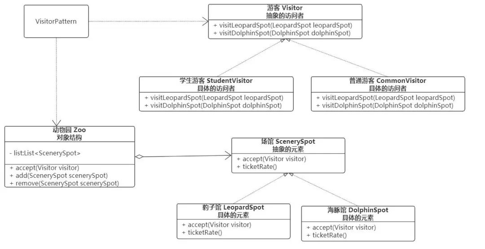

# Visitor

## **应用场景**

通常在以下情况可以考虑使用访问者（Visitor）模式：

- 对象结构相对稳定，但其操作算法经常变化的程序。
- 对象结构中的对象需要提供多种不同且不相关的操作，而且要避免让这些操作的变化影响对象的结构。
- 对象结构包含很多类型的对象，希望对这些对象实施一些依赖于其具体类型的操作。

可以将固定不变的部分封装，并实现accept(visitor)函数来操作这些数据。

经常变动的部分只需要实现visistor接口，来操作这部分不变的部分。

## **场景切入**

动物园中有多个场馆，比如豹子馆，海豚馆，大象馆等等，有些场馆是需要特殊收费的，动物园针对不同类型的游客有不同的收费方式，比如学生半价。

这个场景下，包括以下要素：`动物园`，`动物园中的各个场馆`，`不同类型的游客`，`不同类型的游客票价不同`。

动物园就相当于一个`对象结构`，该结构包含具体的`元素`-各个场馆，每个场馆（元素）都有接待`游客`（visitor）的方法（accept）。

这些被处理的**数据元素相对稳定**（动物园中的场馆一般比较稳定）而**访问方式多种多样**（比如学生散客，学生团体，普通游客，团体游客等不同的访问方式）的数据结构，如果用“**访问者模式**”来处理比较方便。

访问者模式能**把处理方法从数据结构中分离出来**，并可以根据需要增加新的处理方法，且不用修改原来的程序代码与数据结构，这提高了程序的扩展性和灵活性。

## **访问者模式的结构**

通过上面场景的分析，访问者（Visitor）模式实现的关键是**如何将作用于元素的操作分离出来封装成独立的类**，其基本结构如下：

- 抽象的访问者（Visitor）：访问具体元素的接口，为每个具体元素类对应一个访问操作 `visitXX()` ，其参数为某个具体的元素。
- 具体的访问者（ConcreteVisitor）：实现抽象访问者角色中声明的各个访问操作，确定访问者访问一个元素时该做什么。
- 抽象元素（Element）：声明一个包含接受操作 `accept()` 的接口，其参数为访问者对象（`游客`）。
- 具体元素（ConcreteElement）：实现抽象元素角色提供的 accept() 操作，其方法体通常都是 visitor.visitXX(this) ，另外具体元素中可能还包含本身业务逻辑的相关操作。
- 对象结构（Object Structure）：一个包含元素角色的容器，提供让访问者对象遍历容器中的所有元素的方法，通常由 List、Set、Map 等聚合类实现。

针对我之前设定的动物园场景，用访问者模式实现的类图为：

